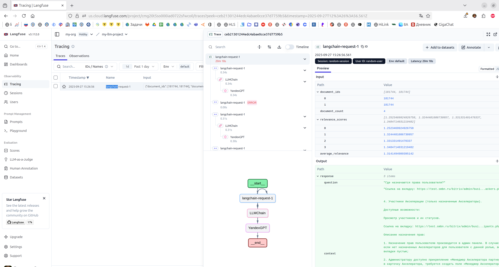
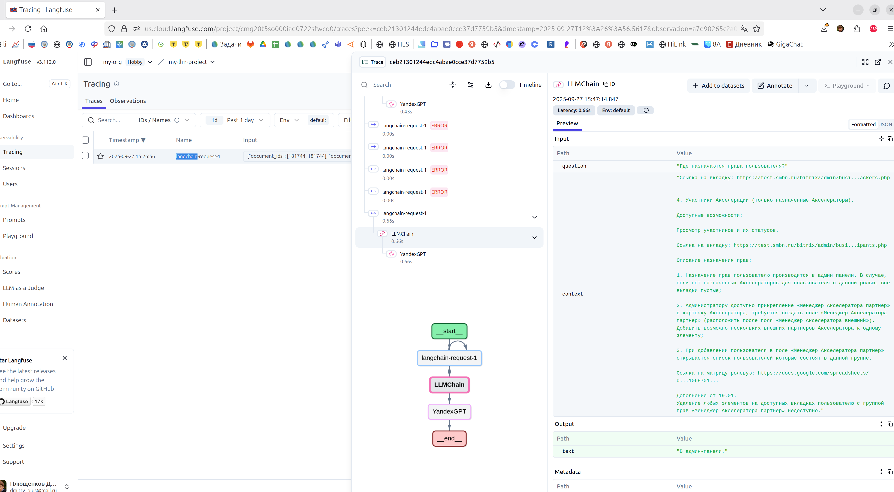

# RAG-система с мониторингом на Langfuse

Собрал RAG систему в помощь аналитику. На входе список задач выгруженных с портала. Задачи векторизуем и сохраняем в FAISS.
При поступлении вопроса - собираем контекст по задачам и отправляем в YandexGPT.

В качестве мониторинга используем Langfuse.

Вот скрины из лк Langfuse.cloud. На каждый запрос сохраняем время выполнения, id и количество документов, релевантность контекста.

