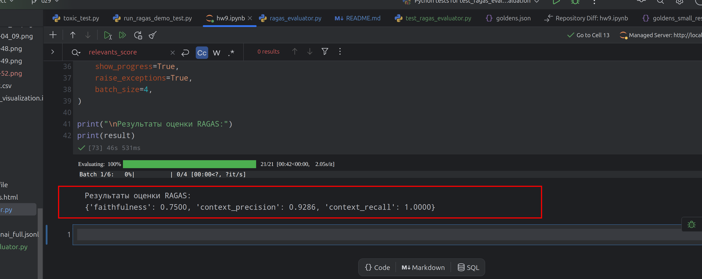
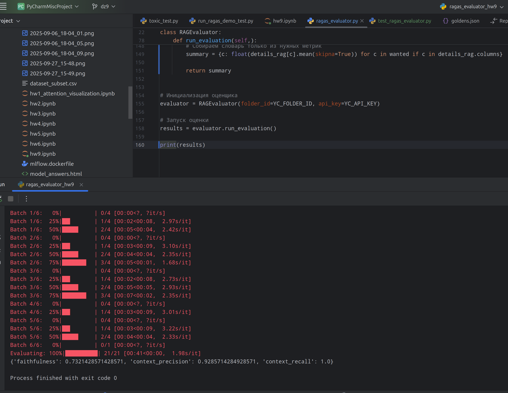
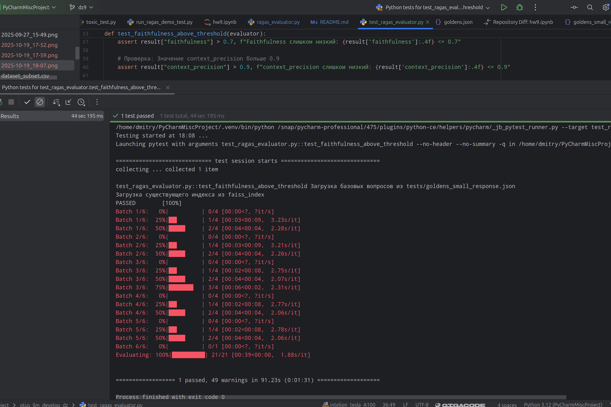
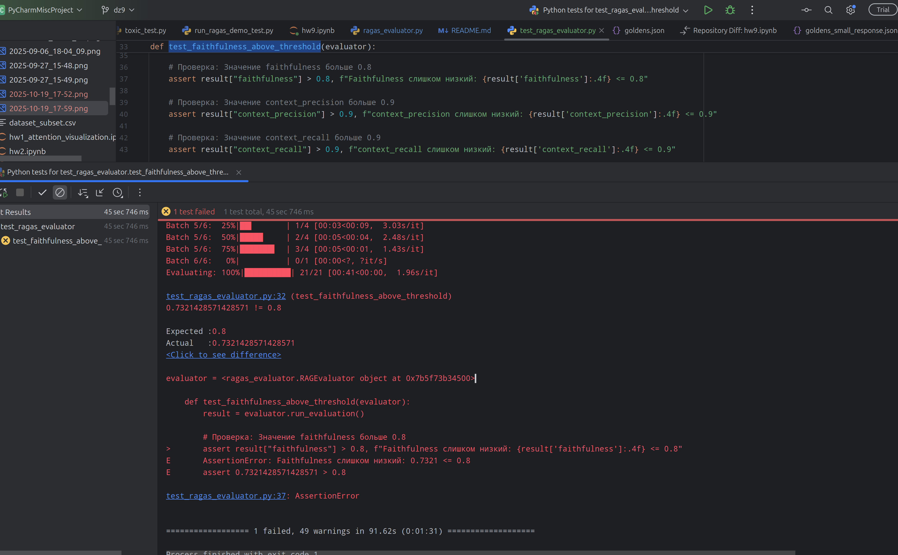

# Дз №9 - RAG-система с метриками RAGAS и автотестами 

Переработана RAG система из ДЗ №5. Переработан код на уменьшение запросов к llm.

В работе используем 2 модели: YandexGpt и YandexGpt-lite

К списку вопросов добавлены поля с эталонными ответами полученными из старшей модели [goldens.json](tests/goldens.json). 

Добавлены метрики RAGAS для оценки результатов младшей модели.

Для расчета метрик в список вопросов добавлены ответы от младшей модели [goldens_small_response.json](tests/goldens_small_response.json)

Код расчета метрик в ноутбуке  [hw9.ipynb](hw9.ipynb)

На его основе создан класс `RAGEvaluator` в файле [ragas_evaluator.py](ragas_evaluator.py) для получения результатов без Jupiter.

Unit тесты по метрикам RAGAS лежат в файле [test_ragas_evaluator.py](test_ragas_evaluator.py)

## Результат полученных метрик RAGAS в ноутбуке `hw9.ipynb`

## Результат запуска кода `ragas_evaluator.py`

## Пройденная проверка по метрикам

## Проваленая проверка на faithfulness > 0.8

