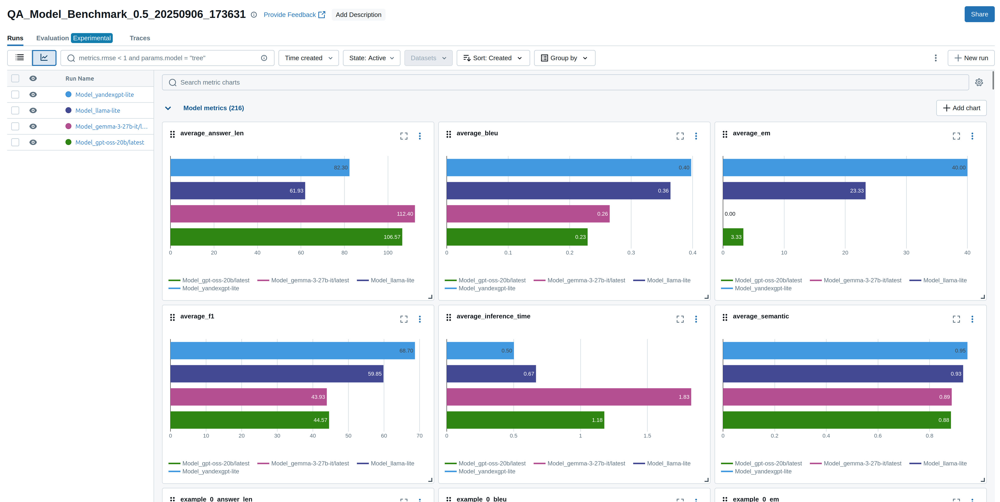
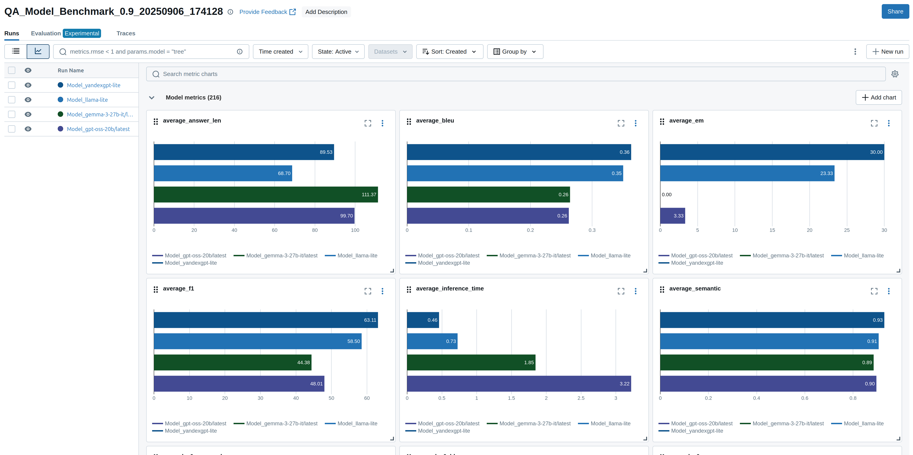

# RAG-система с мониторингом на Langfuse

Собрал RAG систему в помощь аналитику. На входе список задач выгруженных с портала. Задачи векторизуем и сохраняем в FAISS.
При поступлении вопроса - собираем контекст по задачам и отправляем в YandexGPT.

В качестве мониторинга используем Langfuse.

Вот скрины из лк Langfuse.cloud. На каждый запрос сохраняем время выполнения, id и количество документов, релевантность контекста.

# Выводы

## BLEU и Semantic Similarity

По результатам метрик BLEU и Semantic Similarity модель `yandexgpt-lite`  значительно опережает остальные модели. Модель учитывает семантику и смысл текста.
Хорошо понимает синтаксис и точно следует шаблону. Модель стабильна и редко выдает случайные результаты. 

## F1-score и Exact Match
По результатам метрик F1-score и Exact Match, модель `yandexgpt-lite` часто выдает корректные ответы (высокий EM) и редко ошибается при предсказании (высокий F1). 
Модель стабильна и редко выдает случайные результаты. 

По результатам 3х запусков с разной температурой генерации, модель `yandexgpt-lite` лучше всего подходит для задач типа QA и напротив худшие результаты у модели `gemma-3-27b-it`.  

[[]]
[[]]
[[]]
